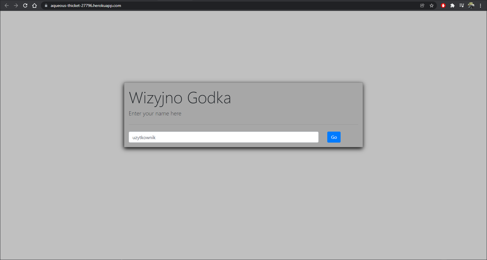

# SIIMZoomCloneApp
## Spis treści
- [Opis projektu](#opis_projektu)
- [Demo](#demo)
- [Instrukcja instalacji i uruchomienia](#instrukcja_instalacji_i_uruchomienia)
- [Założenia projektu i jego realizacja](#założenia_projektu)
- [Licencja](#licencja)

## Opis_projektu

## Demo
#### Ekran startowy

#### Próba nawiązania połączenia z wybranym użytkownikiem

Aplikacja została zamieszczona na platformie Heroku i można ją sprawdzić pod poniższym linkiem:
[SIIMZoomCloneApp na Heroku](https://aqueous-thicket-27796.herokuapp.com/)

## Wykożystane narzedzia
- [Python](https://www.python.org/downloads/)
- [Node.js](https://nodejs.org/en/)

## Instrukcja_instalacji_i_uruchomienia

### Uruchomienie Lokalnie

#### Kroki dla clienta:
- `npm install`
- `npm start`

#### Kroki dla Serwera:
- `pip install -r ./requirements.txt`
- `python ./main.py`

### Uruchomienie przy pomocy konteneryzacji
#### Kroki dla docker-compose:
- `sudo docker-compose build`
- `sudo docker-compose up`

#### Kroki dla dockera:
##### Kroki dla clienta:
- `sudo docker build -t client .`
- `sudo docker run -dp 3000:3000 client -e IP_ADDRES='127.0.0.1'`

##### Kroki dla Serwera:
- `sudo docker build -t server .`
- `sudo docker run -dp 8000:8000 server`

## Założenia_projektu

<ol>
	<li><H5>Nazwa projektu:</H5>
Video czat (Wizyjno Godka)
</li>
	<li><H5>Wizja projektu:</H5>
	
Celem projektu jest implementacja prostego komunikatora, pozwalającego na prowadzenie rozmów z wykorzystaniem strumieniowania wideo oraz audio. Projekt będzie tworzony od podstaw. Głównymi problemami, z którymi będziemy się mierzyć są - poprawne rozdzielenie połączonych użytkowników na pokoje/kanały, w celu umożliwienia prywatnej rozmowy oraz zoptymalizowanie pracy serwera, w szczególności strumieniowania obrazu i dźwięku pomiędzy poszczególnymi socketami. Zła implementacja może prowadzić do występowania opóźnień, a nawet do sytuacji, w której serwer przestanie odpowiadać. Wykonując ten projekt, znacząco rozwiniemy swoje umiejętności w zakresie programowania w językach JavaScript oraz Python. Dodatkowo znacząco rozwiniemy wiedzę z zakresu socketów oraz komunikacji z wykorzystaniem protokołu TCP.

</li>
<li><H5>Cele projektu</H5>
	<ul>
		<li>Implementacja serwera w Pythonie wykorzystując moduły aiohttp i python-socketio,</li>
		<li>Implementacja aplikacji webowej w JavaScript wykorzystując narzędzia React (zgodnie ze standardem WebRTC).</li>
	</ul>
	</li>
	 <li><H5>Zakres projektu</H5>
	 	
Głównym zadaniem niniejszego projektu jest ustanowienie połączenia pomiędzy co najmniej dwoma klientami. W celu umożliwienia takiego połączenia, serwer będzie musiał posiadać możliwość wysłania “listy aktualnie podłączonych użytkowników”. Lista powinna być cyklicznie aktualizowana. Stworzone połączenia w serwerze będą zagregowane do unikalnych kanałów/pokojów, co ułatwi późniejsze ewentualne implementowanie możliwości rozmowy pomiędzy większą ilością klientów. Aplikacja kliencka będzie aplikacją webową. W jej skład wchodzi panel wyboru rozmówców oraz panel, w którym będzie wyświetlane wideo z naszej kamery oraz wideo z kamery odbiorcy. Projekt będzie przystosowany do umieszczenia go na specjalnych stronach hostingowych wspierających serwery w Pythonie oraz JavaScripcie. Dodatkowo, aplikacja będzie mogła również działać w sieci lokalnej. Projekt nie zakłada wsparcia dla komunikacji tekstowej.
</li>
	  <li><H5>Etapy w projekcie</H5>
	  	<ul>
			<li>Przegląd gotowych rozwiązań,</li>
			<li>Wybranie rozwiązania,</li>
			<li>Implementacja Serwera i aplikacji webowej,</li>
			<li>Stworzenie unit testów,</li>
			<li>Testowanie gotowego projektu</li>
		</ul>
	  </li>	 
	<li><H5>Charakterystyka narzędzi</H5>
		<ul>
			<li>JavaScript - skryptowy język programowania, stworzony przez firmę Netscape, najczęściej stosowany na stronach internetowych. Twórcą JavaScriptu jest Brendan Eich,
			<ul>
					<li>React - Biblioteka języka programowania JavaScript, która wykorzystywana jest do tworzenia interfejsów graficznych aplikacji internetowych. Została stworzona przez Jordana Walke, programistę Facebooka, a zainspirowana przez rozszerzenie języka PHP – XHP,</li>
					<li>Socket.IO - Biblioteka JavaScript do aplikacji internetowych w czasie rzeczywistym. Umożliwia dwukierunkową komunikację w czasie rzeczywistym między klientami internetowymi a serwerami.</li>
					<li>WebRTC - Standard HTML5 rozwijany przez World Wide Web Consortium, służący do komunikacji typu P2P, w czasie rzeczywistym, poprzez przeglądarkę internetową. WebRTC można używać do przesyłania danych binarnych lub tekstowych jak i strumieniowego przesyłania audio oraz wideo. </li>
				</ul>
			</li>
			<li>Python - Język programowania wysokiego poziomu ogólnego przeznaczenia, o rozbudowanym pakiecie bibliotek standardowych, którego ideą przewodnią jest czytelność i klarowność kodu źródłowego.
				<ul> 
					<li>Aiohttp - Moduł asynchronicznego serwera HTTP stworzony dla łatwej implementacji serwerów w oparciu o moduł asyncio w Pythonie, </li>
					<li>Python-socketio - Moduł implementujący gniazda oraz umożliwiający integrację z innymi modułami.</li>
				</ul>
			</li>
		</ul>
	</li>
	<li>Dekompozycja projektu Klient może wysyłać do serwera następujące żądania: Zapytanie o listę aktualnie podłączonych użytkowników Podczas ładowania interfejsu użytkownika serwer powinien dostarczyć klientowi informacje o aktualnie zalogowanych użytkownikach Zaproś do rozmowy Jeśli osoba wysyłająca zaproszenie uczestniczy już w rozmowie, serwer wyśle zaproszenie do istniejącego już pokoju. W przeciwnym wypadku tworzony jest nowy pokój. Pokój to miejsce gdzie ustanawiane są WebSockety z każdym z klientów. Dane przychodzące od jednego klienta są rozsyłane do wszystkich pozostałych. Dołącz do rozmowy Po otrzymaniu zaproszenia z serwera, można odpowiedzieć mu na dwa sposoby. Przyjmij lub odrzuć (wow). Zakończ połączenie Klient wysyła do serwera prośbę o zerwanie połączenia z pokojem w którym aktualnie się znajduje.</li>
	<li><H5>Zagwozdki:</H5></li>
	<ul>
		<li>Czy osoba nieuczestnicząca w rozmowie może sama poprosić o przyjęcie do pokoju? (wtedy trzeba by chyba zrobić pierwszego użytkownika jakimś zarządcą pokoju)</li>
		<li>Czy osoba uczestnicząca w rozmowie może otrzymać zaproszenie do innego pokoju?</li>
	</ul>
	
Dajcie znać co myślicie, z czym się zgadzacie a co byście poprawili. W tych zagwozdkach możecie dać jakieś +1 jeśli sądzicie że takie ficzersy mają się pojawić.

</ol>

## Licencja
- [MIT License](https://choosealicense.com/licenses/mit/)
- [Copyright 2020 © ](https://github.com/avresial/SIIMZoomCloneApp)
